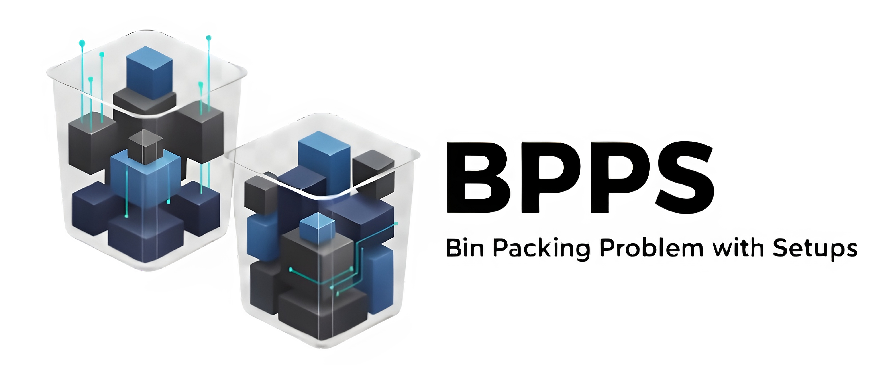

# BPPS Repository

<br>

<p align="center">
  
</p>

<br>


This repository is associated with the research paper:

**"The Bin Packing Problem with Setups: Formulation, Structural Properties and Computational Insights"**  
by R. Baldacci, F. Ciccarelli, S. Coniglio, V. Dose and F. Furini.

It contains the entire set of 480 benchmark instances for the Bin Packing Problem with Setups (BPPS), the instance generator, and an extended version of the computational results reported in the paper.

<br>

## 🎯 Problem Overview

The BPPS is a generalization of the classical Bin Packing Problem where items are partitioned into classes. When at least one item from a given class is packed into a bin, both a setup weight (reducing available capacity) and a setup cost are incurred. The objective is to determine a minimum-cost partition of items into bins such that:

- The total weight of items plus setup weights of active classes does not exceed bin capacity in any bin;
- The total cost — including bin costs and class-specific setup costs — is minimized.

This problem naturally arises in production planning and logistics applications where different item types require specific preparation or configuration steps.

In the referenced paper, we:

- Introduce a novel Integer Linear Programming formulation for this problem and analyze its LP relaxation properties;
- Propose a family of valid inequalities that strengthen the LP relaxation and improve the optimal worst-case performance;
- Derive theoretical upper bounds on the number of bins required, enabling significant problem size reduction;
- Establish a comprehensive benchmark of 480 instances and demonstrate substantial computational improvements through the integration of MCI and bin-number bounds.

<br>

## 📁 Repository Structure

- **[`data/`](data/)**: Instance data and documentation
  - [`data/instances/`](data/instances/): Directory containing all BPPS instance files (480 benchmark instances)
  - [`data/computational_results.xlsx`](data/computational_results.xlsx): Extended computational results reported in the paper (detailed per-instance results)
  - Two small example instances, referring to Figure 1 of the paper.
  
- **[`generator/`](generator/)**: Instance generation toolkit
  - [`generator/bpps_instance_generator.py`](generator/bpps_instance_generator.py): Python script for generating new BPPS instances
  - [`generator/example_usage.py`](generator/example_usage.py): Examples demonstrating different ways to use the generator
  - [`generator/configs/`](generator/configs/): Example configuration files for instance generation
    

<br>


## 📖 Citation

If you use this dataset or the instance generator in academic work, please cite:

```bibtex
@article{Baldacci2025BPPS,
    title={The Bin Packing Problem with Setups: Formulations, Structural Properties, and Computational Insights},
    author={Baldacci, R. and Ciccarelli, F. and Coniglio, S. and Dose, V. and Furini, F.},
    year={2025}
}
```

<br>

For further information, please contact: <f.ciccarelli@uniroma1.it>
